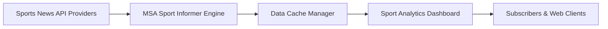

<!-- ========== NEW: ANIMATED WAVE HEADER ========== -->
<!-- ========== NEW: TYPING ANIMATION INTRO ========== -->
<p align="center">
  
</p>

<!-- ========== NEW: HIGH QUALITY PROJECT BANNER ========== -->
<p align="center">
  
</p>


<!-- ========== NEW: AUTHOR & ARCHITECT SECTION ========== -->
## 👨‍💻 Author & Architect

<table>
<tr>
<td align="center" width="160">
  <a href="https://github.com/Sadique721">
    <br>
    <b>Md Sadique Amin</b><br>
    <sub>Backend Java Developer</sub>
  </a>
</td>
<td>

**Md Sadique Amin** — Backend Java Developer.

- 🔗 GitHub: [@Sadique721](https://github.com/Sadique721)
- 📧 Email: mdsadiqueamin721786@gmail.com
- 🏗️ Built: Enterprise BSS-OSS Telecom Suite, Backend Java Developer, IR Interconnect & Roaming

</td>
</tr>
</table>

<!-- ========== NEW: SYSTEM DIAGRAM SECTION ========== -->
## 📊 System Architecture & Workflow



---

# 🏆 MSA SPORT INFORMER — Live Scores, News & Predictions


> **MSA SPORT INFORMER** is a premium, state-of-the-art sports media platform offering live scores, player stats, standings, breaking news, interactive polls, AI predictions, and Youtube/Instagram highlights across multiple sports including **Soccer (Football), Cricket, Basketball, and Tennis**.

Designed and engineered with a modern modular frontend structure, responsive Glassmorphic layout, customizable Dark/Light mode theme, and an interactive **360-degree rotating 3D sports ball viewer** powered by Three.js.

---

## 👨‍💻 Owner & Creator
**Md Sadique Amin**  
*Software Engineer & Sports Tech Content Creator*  
📍 Ahmedabad, Gujarat, India  
📧 [mdsadiqueamin721786@gmail.com](mailto:mdsadiqueamin721786@gmail.com)  
🔗 [Instagram](https://instagram.com/mdsadiqueamin) | [LinkedIn](https://linkedin.com/in/mdsadiqueamin) | [YouTube](https://youtube.com/@mdsadiqueamin721)

---

## ✨ Features (100% Implemented)

| Feature | Description |
|---------|-------------|
| 🏀 **3D Sports Ball Viewer** | Interactive Three.js WebGL scene in the hero section displaying custom textured 3D models (Soccer ball, Basketball, Tennis ball, Cricket ball) with 360-degree mouse/touch dragging, rotation, lighting controls, and scale transitions. |
| ⚽ **Live Match Centre** | Dynamic scoreboard updating real-time scores, period statuses, and commentary text feeds for Soccer, Cricket, Basketball, and Tennis matches. |
| 📰 **Multi-Sports Newsroom** | Real-time news cards with category filters (All / Football / Cricket / Basketball / Tennis) and quick-search functionality. |
| 📈 **Elite Standings & Charts** | Standings points tables for clubs, and interactive player performance charts (Goals, runs, assists, three-pointers, aces) rendered via Chart.js. |
| 📊 **Standalone Rankings** | Three distinct rankings columns updating automatically based on the selected sport (e.g. Test Batting, ODI Bowling, T20 Allrounders for Cricket vs Goals, Assists, Clean Sheets for Football). |
| 🎬 **MSA Originals** | Dedicated highlights slider showcasing YouTube embeds, shorts, and digital vlogs by Md Sadique Amin. |
| 🔥 **Fan Interactive Zone** | Community live chat box, tournament polls, and a predictive match AI forecasting win probabilities. |
| 🎙️ **Voice Search Control** | Embedded webkit speech recognition allowing users to filter news and change active sports themes using voice commands. |
| 🌗 **Dark / Light Theme** | Smooth toggle switch adapting glassmorphic highlights and chart grids with local storage state persistence. |
| 💫 **Advanced Visuals** | GSAP ScrollTrigger reveals, AOS scroll transitions, and a background starry particle network. |

---

## 🛠️ Architecture & Tech Stack

The codebase has been refactored into a modular layout:

```text
├── index.html          # Semantic HTML5 layout structure, navbar, and third-party links
├── src/
│   ├── styles.css      # Core styles, glassmorphic filters, neon glow maps, and dark/light themes
│   ├── app.js          # Controller entrypoint, registers scroll triggers, preloaders, and core loops
│   ├── ui.js           # UI rendering layer managing scorecards, chats, news filters, and speech APIs
│   ├── three-scene.js  # WebGL Three.js controller creating 3D sports ball meshes and touch controls
│   └── api.js          # Database layer containing stats arrays, scores, news articles, and API mock fallbacks
```

### Libraries Used:
- **Tailwind CSS** (v3 CDN) - Grid layout alignment and modern utility classes.
- **Three.js** (v0.128.0) - High-performance 3D scene construction.
- **GSAP & ScrollTrigger** - Clean load transitions and scroll animations.
- **AOS (Animate on Scroll)** - Delayed scroll fade-ins.
- **Chart.js** - Dynamic multi-sport canvas graphing.
- **Swiper.js** - Touch-friendly highlights slideshow.
- **Particles.js** - Animated starry floating background.

---

## 🚀 Setup & Local Running

1. Clone or download this repository:
   ```bash
   git clone https://github.com/Sadique721/MSA-Sport-Informer.git
   ```
2. Navigate to the project directory:
   ```bash
   cd MSA-Sport-Informer
   ```
3. Open `index.html` directly in your browser, or spin up a local development server:
   ```bash
   # Using Live Server in VS Code, or python:
   python -m http.server 8000
   ```
4. Access the app locally at `http://localhost:8000`.

---

## 🌐 Deployment to Netlify

To deploy your site on Netlify:
1. Initialize Netlify configuration (make sure you have `netlify-cli` installed or run via `npx`):
   ```bash
   npx netlify login
   npx netlify init
   ```
2. Deploy the application to production:
   ```bash
   npx netlify deploy --prod
   ```

---

## ⚙️ Renaming Steps (GitHub & Netlify)

### 1. Rename Local Folder
Close the IDE, open terminal, and rename the root directory:
```bash
cd ..
Rename-Item -Path "MSA-Cricket-Informer" -NewName "MSA-Sport-Informer"
# Or on macOS/Linux:
mv MSA-Cricket-Informer MSA-Sport-Informer
```

### 2. Rename on GitHub
1. Log in to **GitHub** and go to `https://github.com/Sadique721/MSA-Cricket-Informer`.
2. Click on the **Settings** tab.
3. Under **Repository name**, change it to `MSA-Sport-Informer` and click **Rename**.
4. Run the local remote update command (already done in this workspace):
   ```bash
   git remote set-url origin https://github.com/Sadique721/MSA-Sport-Informer.git
   ```

### 3. Rename on Netlify
1. Log in to **Netlify** and click on your cricket site dashboard.
2. Navigate to **Site settings** > **General** > **Site details**.
3. Click **Change site name** and rename it to `msa-sport-informer` (or a custom subdomain).
4. Save configuration.


<!-- ========== NEW: FOOTER WAVE ANIMATION ========== -->
<p align="center">
  
</p>